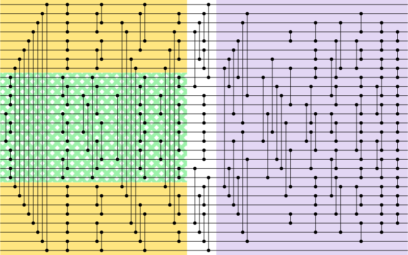

# Depth-13 Sorting Networks for 28 Channels

We found a reflection-symmetric [sorting network](https://en.wikipedia.org/wiki/Sorting_network) with 28 channels and depth 13, improving the previous depth upper bound for 27- and 28-channel networks from 14 to 13. The 28-channel sorting network was found by stacking prefixes from 16-channel and 12-channel networks, adding layers greedily one comparator at a time, and solving for the remaining layers using SAT.

For details, see our [paper](paper/main.pdf).

## Result

**28 channels • 13 layers • 159 comparators**

```
[(0,27),(1,26),(2,25),(3,24),(4,23),(5,22),(6,21),(7,20),(8,9),(10,11),(12,15),(13,14),(16,17),(18,19)]
[(0,1),(2,3),(4,5),(6,7),(8,10),(9,11),(12,14),(13,15),(16,18),(17,19),(20,21),(22,23),(24,25),(26,27)]
[(0,2),(1,3),(4,6),(5,7),(8,19),(9,12),(10,14),(11,16),(13,17),(15,18),(20,22),(21,23),(24,26),(25,27)]
[(0,4),(1,5),(2,20),(3,21),(6,24),(7,25),(8,13),(9,11),(10,17),(12,15),(14,19),(16,18),(22,26),(23,27)]
[(1,2),(3,24),(4,6),(5,22),(7,20),(8,9),(10,12),(11,13),(14,16),(15,17),(18,19),(21,23),(25,26)]
[(0,8),(1,4),(2,6),(3,9),(5,7),(10,11),(12,13),(14,15),(16,17),(18,24),(19,27),(20,22),(21,25),(23,26)]
[(1,10),(2,13),(4,8),(5,12),(6,9),(7,20),(14,25),(15,22),(17,26),(18,21),(19,23)]
[(3,4),(6,14),(7,11),(8,15),(9,17),(10,18),(12,19),(13,21),(16,20),(23,24)]
[(2,4),(5,6),(7,8),(9,13),(11,15),(12,16),(14,18),(19,20),(21,22),(23,25)]
[(2,7),(4,8),(6,10),(9,11),(12,14),(13,15),(16,18),(17,21),(19,23),(20,25)]
[(1,3),(4,7),(5,6),(8,9),(10,12),(11,16),(13,14),(15,17),(18,19),(20,23),(21,22),(24,26)]
[(2,3),(4,5),(6,7),(8,10),(9,12),(11,13),(14,16),(15,18),(17,19),(20,21),(22,23),(24,25)]
[(3,4),(5,6),(7,8),(9,10),(11,12),(13,14),(15,16),(17,18),(19,20),(21,22),(23,24)]  
```

<p align="center">
  
</p>

## Requirements

### Bazelisk

Download Bazelisk from https://github.com/bazelbuild/bazelisk (tested with version 1.27).

**Ubuntu 24.04 (x86) installation:**
```bash
wget https://github.com/bazelbuild/bazelisk/releases/download/v1.27.0/bazelisk-amd64.deb -O /tmp/bazelisk-amd64.deb
sudo apt install /tmp/bazelisk-amd64.deb
```

### C++ Toolchain

This project requires C++20 support. We have tested with Clang 17 and GCC 13. Set the toolchain in the first two lines in `.bazelrc`.

**Ubuntu 24.04 installation:**
```bash
sudo apt install clang
```

**macOS installation:**
Install the Apple C++ toolchain by
```bash
xcode-select --install
```
or install gcc or clang from brew.

### Python 3

Python 3.12 or later is required (tested with 3.12).

### MiniSat

This project uses MiniSat SAT solver: http://minisat.se/

Install MiniSat. If `minisat` is not in the `$PATH`, set it to the environment variable `MINISAT`, e.g. `export MINISAT=$HOME/minisat/build/release/bin/minisat`. Build MiniSat from the source code (a little bit faster), or install it as below.

**Ubuntu 24.04 installation:**
```bash
sudo apt install minisat
```

**macOS installation:**
```bash
brew install minisat
```

## Build and Test

Build all required executables:
```bash
bazel build -c opt :add_layers_main :stack_main :add_comparators_main :optimize_window_size_main :sat_generate_cnf_main :decode_solution_main
```

**Note for macOS users:** If using Apple clang, add `--config=macos` to the build command.

**Optional:** Run the complete test suite:
```bash
bazel test -c opt //...
```

## Run

Follow these steps to generate the sorting networks with 28 channels and 13 layers. It takes less than 20 minutes to run all these steps on a Mac Mini M2 with 16GB memory.

### Create Output Directory
All the program outputs are saved in the `generated` directory.
```bash
mkdir -p generated
```

### Generate 12-Channel Prefixes

Find the best 4 prefixes with 5 layers on 12 channels:
```bash
bazel-bin/add_layers_main --n 12 --symmetric --input_depth 1 --output_depth 5 --output_path generated/n12d5.pb --keep_best_count ,,,4
```

### Generate 16-Channel Prefixes

Find the best 2 prefixes with 5 layers on 16 channels:
```bash
bazel-bin/add_layers_main --n 16 --symmetric --input_depth 1 --output_depth 5 --output_path generated/n16d5.pb --keep_best_count 1,1,1,1
```

### Stack Prefixes

Stack the 12-channel and 16-channel prefixes into a 28-channel network with 5 layers:
```bash
bazel-bin/stack_main --symmetric --n_a 12 --input_path_a generated/n12d5.pb --n_b 16 --input_path_b generated/n16d5.pb --output_path generated/n28d5.pb
```

### Add a Layer

Extend the network to 6 layers:
```bash
bazel-bin/add_comparators_main --symmetric --input_path generated/n28d5.pb --output_path generated/n28d6.pb --keep_best_count 64
```

### Optimize Channel Permutation

Permute channels to optimize the window size for fast SAT solving:
```bash
bazel-bin/optimize_window_size_main --n 28 --symmetric --input_path generated/n28d6.pb --output_path generated/n28d6.opt.pb
```

### Generate SAT Problem

Encode the remaining layers (7-13) as a SAT problem:
```bash
bazel-bin/sat_generate_cnf_main --n 28 --symmetric --depth 13 --input_path generated/n28d6.opt.pb --output_dir generated/cnf/ --limit 8
```

### Solve with MiniSat

Solve the generated SAT problems:
```bash
python3 sat_solve_main.py --keep_going --solver=minisat generated/cnf/
```

### Decode Solutions

Convert the SAT solutions back to sorting networks and simplify them by removing unnecessary comparators:
```bash
bazel-bin/decode_solution_main --symmetric --prefix_file generated/n28d6.pb --permuted_prefix_file generated/n28d6.opt.pb --cnf_dir generated/cnf/ --permutation_file generated/n28d6.opt.pb.perm --output_pb_path generated/solution.pb --output_bracket_path generated/solution.txt --simplify
```

The final sorting networks will be saved in `generated/solution.txt`.

## Other Tools
`network_info_main` shows and verfies networks.

`draw.py` plots a network into svg format, and convert them to png and pdf (needs ImageMagick convert).
